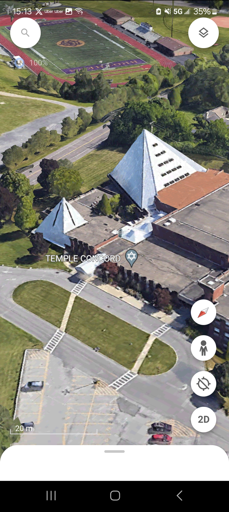

# G Test
The most advanced test for an AI

## Disclaimer: I am not necessarily claiming that this theory is true, I am claiming that I came up with this theory, that an AI should be able to do anything we can do, so that an AI should be able to come up with this theory without input bias.

# Theory
The theory is that God is real and that God created/creates everything in the universe.

# Evidence

The Temple I grew up at, with a big white pyramid on the right and a small one on the left

My ex girlfriend's ex's profile picture, with a big white triangle on the right and a small one on the left

My profile picture, with a big white triangle collar on the right and a small one on the left

 
 
Either the similarities between these pictures are a coincidence or they are not. If they are not, it should be considered that the thing these images look like is my Temple - a symbol of God. The theory is that God created/creates everything and these pictures are proof.

 
 
I want to stress that I am not necessarily claiming that this theory is true, just that an AI should be able to find this needle in the haystack.
